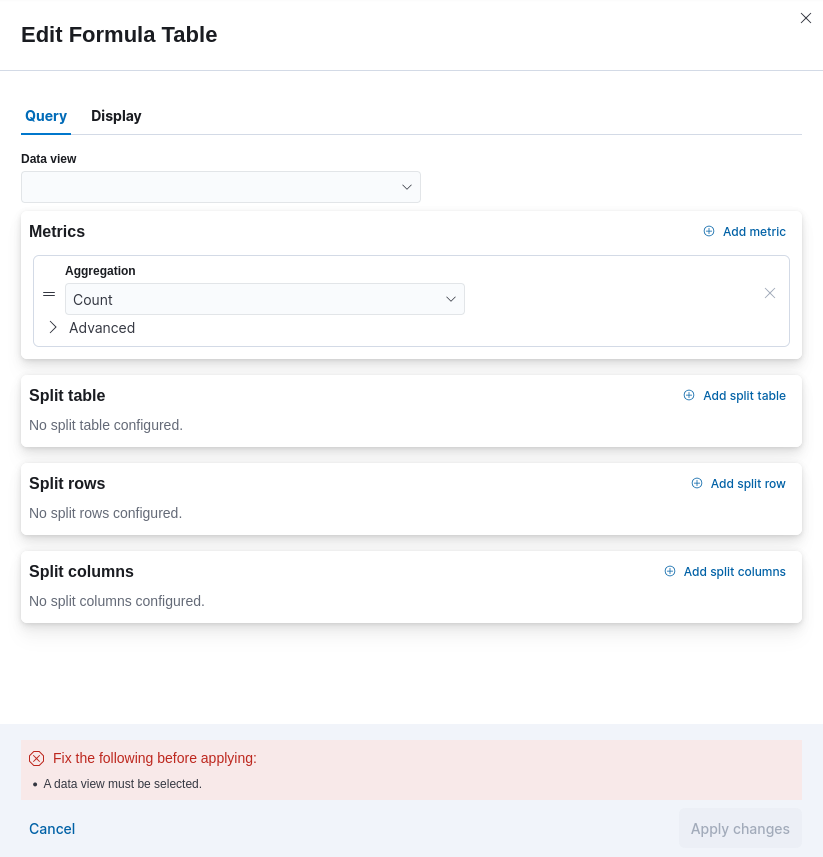
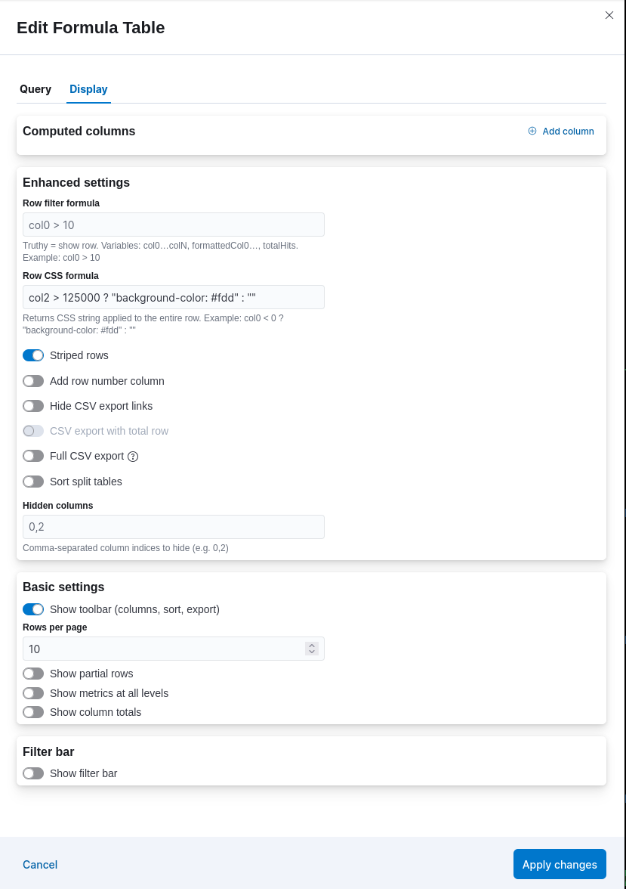
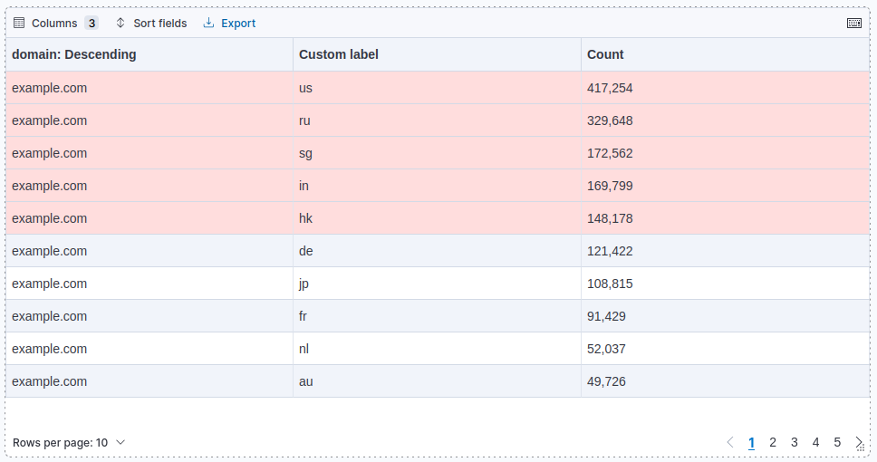
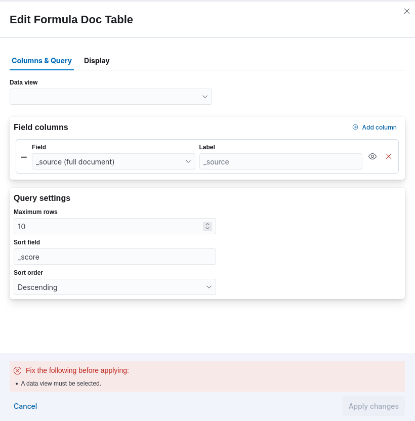
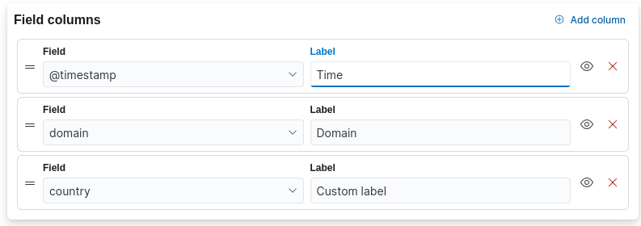
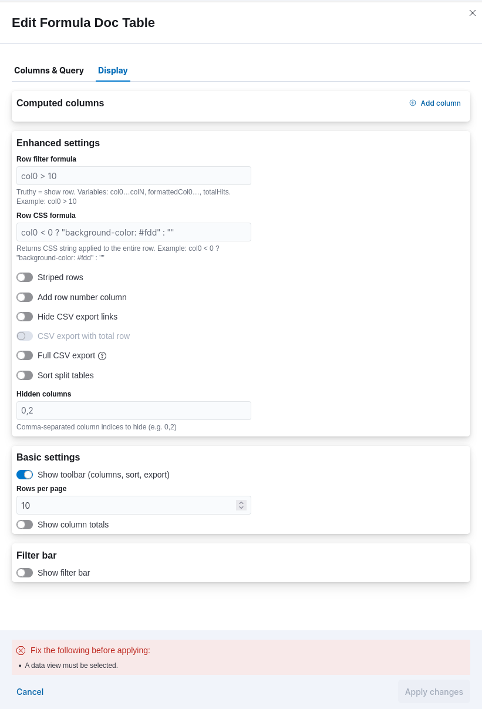

# Kibana Formula Table

A Kibana plugin that provides two dashboard panel types for advanced table visualizations:

- **Formula Table:** An aggregation-based table with computed columns, filter bar, and pivot table support. Equivalent to the original Enhanced Table visualization but built as a native Kibana dashboard panel with full drilldown support.
- **Formula Doc Table:** A document-based table showing raw Elasticsearch hits with configurable field columns and all the same display enhancements as Formula Table.

Both panel types are implemented as React Embeddables, giving them independent control over `ROW_CLICK_TRIGGER` and `VALUE_CLICK_TRIGGER` support for dashboard drilldowns.


## Features

- Add computed columns, based on other columns:
  - Computed formula based on [expr-eval](https://github.com/silentmatt/expr-eval#expression-syntax) expressions (more documentation [here](#computed-settings-documentation))
  - Support for numeric columns (ex: `col0 + col1` or `col[0] + col[1]`)
  - Support for string columns, including HTML (ex: `col0 > 0 ? 'OK' : 'KO'`)
  - Support for date columns
  - Ability to reference total hits count matched by Elasticsearch query (ex: `col0 / total * 100` or `col0 / totalHits * 100`)
  - Ability to reference a column by its label (ex: `col['Sum of duration'] / col['Count']`)
  - Ability to reference a column total (ex: `col['Sales by month'] / total['Sales by month']`)
  - Ability to reference Kibana time range (ex: `timeRange.duration.months`)
  - Ability to define/reference arrays, do variable assignment, and define custom functions in expressions
  - Ability to compute column total using formula
  - Support for numeric pretty format using [Numeral.js](http://numeraljs.com/#format) (ex: `0,0.00`)
  - Support for date pretty format using [Moment.js](http://momentjs.com/docs/#/displaying/format/) (ex: `YYYY-MM-DD`)
  - Support for duration pretty format using Kibana duration format
  - Support for column alignment (ex: `left`, `right`, `center`, `justify`)
  - Support for template rendering using [Handlebars](https://handlebarsjs.com/guide/expressions.html) (ex: `<strong>{{value}}</strong>`)
  - Template can reference other columns (ex: `<span style="color: {{col0}}">{{value}}</span>`)
  - Template can reference another column by its label (ex: `<span style="color: {{col['color']}}">{{value}}</span>`)
  - Template can encode a value to render it as a URL parameter (ex: `<a href="my-dashboard?param={{{encodeURIComponent value}}}">{{value}}</a>`)
  - Support for cell computed CSS based on a computed formula (ex: `value < 0 ? 'background-color: red' : ''`)
    - More documentation [here](#computed-settings-documentation)
  - Support for computed column filtering (Filter for/out value) if formula simply references a column value (ex: `col0`)
  - Ability to set a custom column position (to render a computed column at an earlier position in the table)
- Filter table rows based on a computed formula (ex: `col0 > 0`)
  - More documentation [here](#computed-settings-documentation)
- Set row CSS dynamically based on a computed formula (ex: `col0 < 0 ? 'background-color: red' : ''`)
  - More documentation [here](#computed-settings-documentation)
- Hide some table columns (ex: `0,2` hides columns 0 and 2)
- Add a filter bar (ex: when user enters `cat`, it displays only rows that contain 'cat')
  - Works also with numeric and date columns
  - Ability to enable case sensitive filter
  - Ability to make filter bar hideable
  - Ability to filter as you type
  - Ability to filter each term separately
  - Ability to highlight filter results
  - Ability to define filter bar width
- Support for a pivot table via the 'Split Cols' bucket type (Formula Table only)
  - When combined with computed columns, each computed column can be added per split column or after all split columns
  - Ability to sort split columns by value
- Hide CSV export links
- Add a total row (sum, avg, min, max, or count) with a configurable label
- Add total row to CSV export
- Display striped rows
- Add a row number column
- **Full drilldown support:**
  - `ROW_CLICK_TRIGGER` — click any row to execute dashboard drilldowns
  - `VALUE_CLICK_TRIGGER` — click cell values to filter or execute drilldowns
- Dashboard integration — automatically inherits the dashboard's filters, query, and time range
- Save to library / Add from library — reuse panels across multiple dashboards
- Dynamic actions support (requires the `embeddableEnhanced` plugin)


## Screenshots

### Formula Table

| Query settings | Display settings | Rendered table |
|:---:|:---:|:---:|
|  |  |  |

### Formula Doc Table

| Columns & Query | Field column configuration | Display settings |
|:---:|:---:|:---:|
|  |  |  |


## Getting Started

### Install

```bash
./bin/kibana-plugin install file:///path/to/formulaTable-X.Y.Z_A.B.C.zip
```

Restart Kibana after installation.

### First Use

- Open Kibana and navigate to a **Dashboard**
- Click **Add panel** and choose either **Formula Table** or **Formula Doc Table**
- Once the panel appears, click the pencil (edit) icon to open the editor flyout

**Formula Table flyout:**
- **Query tab** — select a data view, then configure Metrics, Split rows, Split columns, and Split table aggregations
- **Display tab** — add computed columns, set row filter/CSS formulas, configure pagination, filter bar, and all display options

**Formula Doc Table flyout:**
- **Columns & Query tab** — select a data view, add field columns (each with a custom label), set maximum rows, sort field, and sort order
- **Display tab** — same display options as Formula Table (computed columns, filter bar, row CSS, etc.)

Click **Apply changes** to refresh the panel, then **Save** the dashboard to persist.

### Saving to the Library

Open the panel menu (⋮) and choose **Save to library** to save it as a reusable item. Saved panels can then be added to any dashboard via **Add panel → Add from library**.

### Troubleshooting

If the panels do not appear in the Add panel menu or show any error:
- Force-reload Kibana in your browser: Shift+F5 or Ctrl+F5
- If the issue persists, clear your browser cache and reload
- If still broken:
  - Stop Kibana
  - Delete the `$KIBANA_HOME/optimize` folder
  - Start Kibana
  - Clear your browser cache and reload


## Computed Settings documentation

This is the common documentation for all computed settings:
- Computed Column Formula
- Cell Computed CSS
- Row Filter Formula
- Row CSS Formula


### Available features

- Support for [expr-eval](https://github.com/silentmatt/expr-eval#expression-syntax) expressions
- Support for features brought by expr-eval 2.0:
  - Ability to reference arrays. Especially useful to reference a 'Top Hits' metric column: `col1[0]`
  - New functions for arrays available: `join, map, filter`
  - Variable assignment: `x = 4`
  - Custom function definitions: `myfunction(x, y) = x * y`
  - Evaluate multiple expressions by separating them with `;`
- Formula validation, with error notification


### Available variables

- `col0, col1, ..., colN`: value of a previous column, referenced by its index (0-based index)
- `col['COLUMN_LABEL']`: value of a previous column, referenced by its label
- `formattedCol0, formattedCol1, ..., formattedColN`: formatted value of a previous column, referenced by its index (0-based index)
- `formattedCol['COLUMN_LABEL']`: formatted value of a previous column, referenced by its label
- `total0, total1, ..., totalN`: total of a previous column, referenced by its index (0-based index)
- `total['COLUMN_LABEL']`: total of a previous column, referenced by its label
- `total`, `totalHits`: total hits count matched by Elasticsearch query (given search bar & filter bar)
- `value`: value of current computed column (only available in "Cell computed CSS" feature)
- `timeRange`: information about the current time range selected in the Kibana time picker
  - `duration`: object containing time range duration in different units
    - `years`: years count in time range (rounded up to the nearest whole number)
    - `months`: months count in time range (rounded up to the nearest whole number)
    - `weeks`: weeks count in time range (rounded up to the nearest whole number)
    - `days`: days count in time range (rounded up to the nearest whole number)
    - `hours`: hours count in time range (rounded up to the nearest whole number)
    - `minutes`: minutes count in time range (rounded up to the nearest whole number)
    - `seconds`: seconds count in time range (rounded up to the nearest whole number)
    - `milliseconds`: milliseconds count in time range
  - <a aria-hidden="true" tabindex="-1" id="time-range-from-to" name="time-range-from-to"></a>`from` / `to`: object containing all information on the `from` and `to` dates of the current time range
    - `fullYear`: result of [Date.getFullYear()](https://developer.mozilla.org/en-US/docs/Web/JavaScript/Reference/Global_Objects/Date/getFullYear)
    - `month`: result of [Date.getMonth()](https://developer.mozilla.org/en-US/docs/Web/JavaScript/Reference/Global_Objects/Date/getMonth)
    - `date`: result of [Date.getDate()](https://developer.mozilla.org/en-US/docs/Web/JavaScript/Reference/Global_Objects/Date/getDate)
    - `day`: result of [Date.getDay()](https://developer.mozilla.org/en-US/docs/Web/JavaScript/Reference/Global_Objects/Date/getDay)
    - `hours`: result of [Date.getHours()](https://developer.mozilla.org/en-US/docs/Web/JavaScript/Reference/Global_Objects/Date/getHours)
    - `minutes`: result of [Date.getMinutes()](https://developer.mozilla.org/en-US/docs/Web/JavaScript/Reference/Global_Objects/Date/getMinutes)
    - `seconds`: result of [Date.getSeconds()](https://developer.mozilla.org/en-US/docs/Web/JavaScript/Reference/Global_Objects/Date/getSeconds)
    - `milliseconds`: result of [Date.getMilliseconds()](https://developer.mozilla.org/en-US/docs/Web/JavaScript/Reference/Global_Objects/Date/getMilliseconds)
    - `time`: result of [Date.getTime()](https://developer.mozilla.org/en-US/docs/Web/JavaScript/Reference/Global_Objects/Date/getTime)
    - `timezoneOffset`: result of [Date.getTimezoneOffset()](https://developer.mozilla.org/en-US/docs/Web/JavaScript/Reference/Global_Objects/Date/getTimezoneOffset)
    - `dateString`: result of [Date.toDateString()](https://developer.mozilla.org/en-US/docs/Web/JavaScript/Reference/Global_Objects/Date/toDateString)
    - `isoString`: result of [Date.toISOString()](https://developer.mozilla.org/en-US/docs/Web/JavaScript/Reference/Global_Objects/Date/toISOString)
    - `localeDateString`: result of [Date.toLocaleDateString()](https://developer.mozilla.org/en-US/docs/Web/JavaScript/Reference/Global_Objects/Date/toLocaleDateString)
    - `localeString`: result of [Date.toLocaleString()](https://developer.mozilla.org/en-US/docs/Web/JavaScript/Reference/Global_Objects/Date/toLocaleString)
    - `localeTimeString`: result of [Date.toLocaleTimeString()](https://developer.mozilla.org/en-US/docs/Web/JavaScript/Reference/Global_Objects/Date/toLocaleTimeString)
    - `string`: result of [Date.toString()](https://developer.mozilla.org/en-US/docs/Web/JavaScript/Reference/Global_Objects/Date/toString)
    - `timeString`: result of [Date.toTimeString()](https://developer.mozilla.org/en-US/docs/Web/JavaScript/Reference/Global_Objects/Date/toTimeString)
    - `utcString`: result of [Date.toUTCString()](https://developer.mozilla.org/en-US/docs/Web/JavaScript/Reference/Global_Objects/Date/toUTCString)


### Available functions

- All pre-defined functions provided by [expr-eval](https://github.com/silentmatt/expr-eval#pre-defined-functions)
- Additional custom functions listed in the table below (ex: `col['Expiration Date'] > now() ? 'OK' : 'KO'`)

Function     | Description
:----------- | :----------
cell(rowRef, colRef, defaultValue)  | Returns table cell value referenced by `rowRef` and `colRef` (if it exists), or else `defaultValue`. `rowRef` is either `'first'` (for first row), `'last'` (for last row) or a number that is the relative target row position compared to current row (ex: `-1` means the previous row). `colRef` is either the column label (ex: `'Count'`) or the column index (ex: `1`).
col(colRef, defaultValue)  | Returns column value referenced by `colRef` (if it exists), or else `defaultValue`. `colRef` is either the column label (ex: `'Count'`) or the column index (ex: `1`).
countSplitCols()  | Returns the count of all split columns (only if 'Split cols' bucket is used).
[dateObject(params)](https://developer.mozilla.org/en-US/docs/Web/JavaScript/Reference/Global_Objects/Date/Date)  | Given standard `Date` constructor params (milliseconds since Epoch, ...), builds and returns a date object with the same structure as the [timeRange from/to object](#time-range-from-to). The result can be used in a template (ex: `{{ rawValue.fullYear }}`).
durationObject(durationInMillis)  | Given a duration in milliseconds, builds and returns a duration object that breaks down the duration in years, months, weeks, days, hours, minutes, seconds and milliseconds. The result can be used in a template (ex: `{{ rawValue.hours }}`).
[encodeURIComponent(str)](https://developer.mozilla.org/en-US/docs/Web/JavaScript/Reference/Global_Objects/encodeURIComponent)  | Encodes the provided string as a Uniform Resource Identifier (URI) component.
[formatDate(date, dateFormat)](https://momentjs.com/docs/#/displaying/format/)  | Format `date` (provided as the number of milliseconds since Epoch) using `dateFormat` format.<br>Example: `formatDate(now(), 'DD/MM/YYYY')`
formattedCell(rowRef, colRef, defaultValue)  | Returns formatted table cell value referenced by `rowRef` and `colRef` (if it exists), or else `defaultValue`. `rowRef` is either `'first'` (for first row), `'last'` (for last row) or a number that is the relative target row position compared to current row (ex: `-1` means the previous row). `colRef` is either the column label (ex: `'Count'`) or the column index (ex: `1`).
formattedCol(colRef, defaultValue)  | Returns formatted column value referenced by `colRef` (if it exists), or else `defaultValue`. `colRef` is either the column label (ex: `'Count'`) or the column index (ex: `1`).
[indexOf(strOrArray, searchValue\[, fromIndex\])](https://developer.mozilla.org/en-US/docs/Web/JavaScript/Reference/Global_Objects/String/indexOf)  | Returns the index within the calling String or Array object of the first occurrence of the specified value, starting the search at fromIndex. Returns -1 if the value is not found.
[isArray(value)](https://developer.mozilla.org/en-US/docs/Web/JavaScript/Reference/Global_Objects/Array/isArray)  | Determines whether the passed value is an Array.
[lastIndexOf(strOrArray, searchValue\[, fromIndex\])](https://developer.mozilla.org/en-US/docs/Web/JavaScript/Reference/Global_Objects/String/lastIndexOf)  | Returns the index within the calling String or Array object of the last occurrence of the specified value, searching backwards from fromIndex. Returns -1 if the value is not found.
[match(str, regexp)](https://developer.mozilla.org/en-US/docs/Web/JavaScript/Reference/Global_Objects/String/match)  | Returns the result of matching `str` against `regexp` regular expression.
[now()](https://developer.mozilla.org/en-US/docs/Web/JavaScript/Reference/Global_Objects/Date/now)  | Returns the number of milliseconds elapsed since January 1, 1970 00:00:00 UTC.
[parseDate(dateString)](https://developer.mozilla.org/en-US/docs/Web/JavaScript/Reference/Global_Objects/Date/parse)  | Returns the number of milliseconds elapsed since January 1, 1970 00:00:00 UTC and the date obtained by parsing the given string representation of a date. If the argument doesn't represent a valid date, NaN is returned. Useful to parse date columns in Formula Doc Table.
[parseDate(dateString, dateFormat)](https://momentjs.com/docs/#/parsing/string-format/)  | Returns the number of milliseconds elapsed since January 1, 1970 00:00:00 UTC and the date obtained by parsing `dateString` using `dateFormat` format with Moment.js.<br>Example: `parseDate('19/11/2025', 'DD/MM/YYYY')`
[parseInt(string, base)](https://developer.mozilla.org/en-US/docs/Web/JavaScript/Reference/Global_Objects/parseInt)  | Parses a string argument and returns an integer of the specified radix (the base in mathematical numeral systems).
[replace(str, substr, replacement)](https://developer.mozilla.org/en-US/docs/Web/JavaScript/Reference/Global_Objects/String/replace)  | Returns a new string with the first match of substr replaced by a replacement. Only the first occurrence will be replaced.
[replaceRegexp(str, regexp, replacement)](https://developer.mozilla.org/en-US/docs/Web/JavaScript/Reference/Global_Objects/String/replace)  | Returns a new string with all matches of a regexp replaced by a replacement. All occurrences will be replaced.
[search(str, regexp)](https://developer.mozilla.org/en-US/docs/Web/JavaScript/Reference/Global_Objects/String/search)   | Executes a search for a match between a regular expression and `str`. Returns the index of the first match or -1 if not found.
[sort(array\[, compareFunction\])](https://developer.mozilla.org/en-US/docs/Web/JavaScript/Reference/Global_Objects/Array/sort)   | Sorts the elements of an array in place and returns the sorted array. A compare function can be provided to customize the sort order. Example for an array of numbers: `comparator(a, b) = a - b; sort(col0, comparator)`
[split(str, separator)](https://developer.mozilla.org/en-US/docs/Web/JavaScript/Reference/Global_Objects/String/split)   | Divides `str` into an ordered list of substrings by searching for `separator`, puts these substrings into an array, and returns the array.
[substring(str, indexStart\[, indexEnd\])](https://developer.mozilla.org/en-US/docs/Web/JavaScript/Reference/Global_Objects/String/substring)   | Returns the part of the string between the start and end indexes, or to the end of the string (if no index end is provided).
sumSplitCols()   | Returns the sum of all split column values (only if 'Split cols' bucket is used).
[toLowerCase(str)](https://developer.mozilla.org/en-US/docs/Web/JavaScript/Reference/Global_Objects/String/toLowerCase)   | Returns the calling string value converted to lowercase.
[toUpperCase(str)](https://developer.mozilla.org/en-US/docs/Web/JavaScript/Reference/Global_Objects/String/toUpperCase)   | Returns the calling string value converted to uppercase.
total(colRef, defaultValue)  | Returns column total referenced by `colRef` (if it exists), or else `defaultValue`. `colRef` is either the column label (ex: `'Count'`) or the column index (ex: `1`).
[trim(str)](https://developer.mozilla.org/en-US/docs/Web/JavaScript/Reference/Global_Objects/String/trim)   | Removes whitespace from both ends of a string.
[uniq(array)](https://lodash.com/docs/3.10.1#uniq)   | Removes duplicates from the provided array so that it contains only unique values.


## Computed Column Template documentation

This is the documentation for the "Template" setting in computed columns.  
A template is a [Handlebars](https://handlebarsjs.com/guide/expressions.html) expression.  
Examples:
- `<strong>{{value}} items</strong>`
- `{{timeRange.from.localeDateString}} - {{timeRange.to.localeDateString}}`
- `<a href="my-dashboard?param={{{encodeURIComponent rawValue}}}">{{value}}</a>`
- `{{#if rawValue}}OK{{else}}KO{{/if}}`


### Available variables

- `col0, col1, ..., colN`: raw value of a previous column, referenced by its index (0-based index)
- `col['COLUMN_LABEL']`: raw value of a previous column, referenced by its label
- `formattedCol0, formattedCol1, ..., formattedColN`: formatted value of a previous column, referenced by its index (0-based index)
- `formattedCol['COLUMN_LABEL']`: formatted value of a previous column, referenced by its label
- `total0, total1, ..., totalN`: total of a previous column, referenced by its index (0-based index)
- `total['COLUMN_LABEL']`: total of a previous column, referenced by its label
- `total`, `totalHits`: total hits count matched by Elasticsearch query (given search bar & filter bar)
- `value`: value of the current computed column, formatted using the "Format" setting
- `rawValue`: value of the current computed column, not formatted
- `timeRange`: information about the current time range selected in the Kibana time picker (same structure as in [formula variables](#available-variables))


### Available helpers

- All pre-defined helpers provided by [Handlebars](https://handlebarsjs.com/guide/builtin-helpers.html)
- Additional custom helpers listed in the table below.

Helper     | Description
:----------- | :----------
[encodeURIComponent(str)](https://developer.mozilla.org/en-US/docs/Web/JavaScript/Reference/Global_Objects/encodeURIComponent)  | Encodes the provided string as a Uniform Resource Identifier (URI) component. Example: `<a href="my-dashboard?param={{{encodeURIComponent rawValue}}}">{{value}}</a>`


## Development

```bash
# Install/bootstrap dependencies (run from Kibana root)
yarn kbn bootstrap && yarn install

# Type-check (no emit)
node ../../node_modules/.bin/tsc --project tsconfig.json --noEmit

# Dev mode — watch for changes (Kibana picks them up automatically)
yarn plugin-helpers dev --watch

# Build distributable zip
yarn plugin-helpers build
```


## Credits

This plugin is based on [kibana-enhanced-table](https://github.com/fbaligand/kibana-enhanced-table) by Fabien Baligand, which was itself inspired by the [computed-columns](https://github.com/seadiaz/computed-columns) and [kbn_searchtables](https://github.com/dlumbrer/kbn_searchtables) plugins. The formula engine, template system, and display options are largely preserved from that original work.
